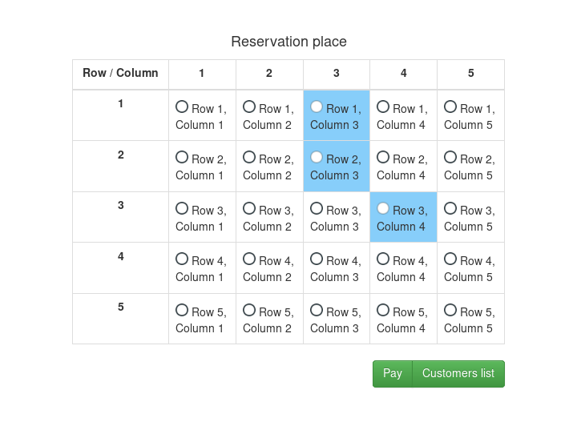
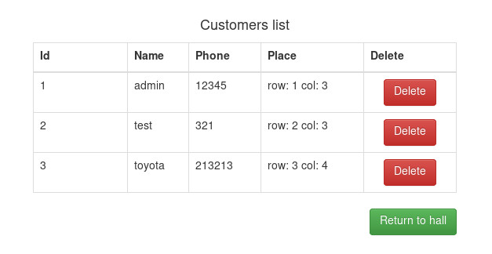

# Servlet API, Javascript, AJAX, liquibase

- servlet_8 - веб-приложение регистрации пользователей. Базовые crud операции,
аутентификация по ролям.

- servlet_9 - веб-приложение "Кинотеатр". Реализована бронировка мест конкретным пользователем.
Реализованы основные crud операции, для генерации схемы испльзуется liquibase.

