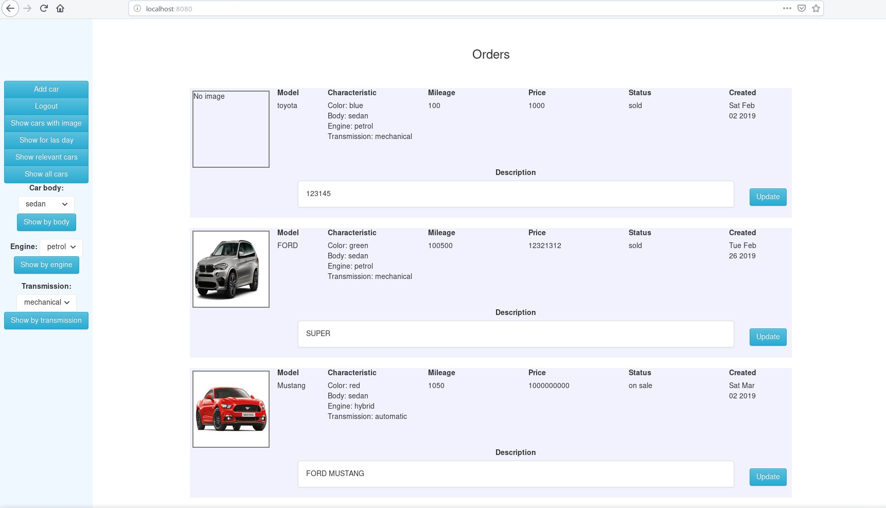

# Проект 'площадка автомобилей'

Приложение - площадка для объявлений по продаже автомобилей.
Пользователь проходит регистрацию и может выкладывать автомобили
на продажу. При этом указываются цена, параметры автомобиля, 
прикладывается фотография. Пользователь может редактировать свои объявления.`

С помощью liquibase создается схема базы данных. Добавляется пользователь
по умолчанию ('root', 'root');

Используется tomcat 9 в качестве контейнера сервлетов.
Перед запуском **liquibase:update** для создания схемы базы данных.
